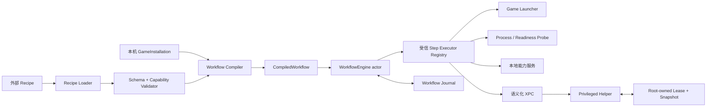

# 工作流运行时设计

Status: draft  
Owner: TingungX  
Last updated: 2026-08-24  
Scope: 外部游戏配方、工作流执行、状态恢复、特权能力调用  
Related code: `Sources/MacGameToolbox/AppModel.swift`, `Sources/MacGameToolboxCore/`, `Sources/MacGameToolboxPrivilegedHelper/`  
Related docs: `../decisions/0001-capability-bounded-external-recipes.md`, `../specs/phase-1-genshin-workflow.md`

## 背景与问题

当前应用以功能卡片为入口，由 `AppModel` 分别编排 hosts、固定倒计时、Wine 进程检测和优先级调整。能力之间没有统一的执行模型：

- 用户必须在倒计时内手动启动游戏，应用并不拥有完整启动流程。
- 系统副作用只依赖局部 `defer` 风格恢复；App、helper 或系统异常退出后没有统一事务记录。
- 游戏差异硬编码在服务和界面中，新增游戏会继续扩大条件分支。
- 当前 XPC 请求表达单次操作，不表达运行租约、补偿动作或崩溃恢复。

目标不是增加一个通用脚本执行器，而是建立一套由外部配方描述、由 App 内受信代码执行的游戏工作流运行时。

## 目标

- 每款游戏提供一个主要的“一键启动”入口。
- 将现有 MetalHUD、网络控制、进程检测和 QoS 等能力复用为工作流步骤。
- 允许用户编辑或导入配方，同时保证配方不能执行任意代码或任意 root 命令。
- 所有系统副作用都具备可验证的补偿动作、持久记录和超时恢复。
- 运行日志能够回答每一步何时开始、为何完成、为何失败以及是否完成恢复。
- 配方与本机安装信息分离，使配方可以共享，而不携带用户路径或机器状态。

## 非目标

- 第一阶段不提供任意 shell、AppleScript、动态库或插件执行能力。
- 第一阶段不建立在线配方市场、远程自动更新或配方签名基础设施。
- 第一阶段不承诺定向绕过任何反作弊；网络策略必须由本机实测证据决定。
- 第一阶段不并行运行多个游戏工作流。
- `Mac GameFlow` 只是内部工作名，本设计不决定正式品牌。

## 核心模型

### Recipe

外部 JSON 文件描述可移植的游戏流程。它可以引用运行时公开的步骤类型和受限参数，但不能包含绝对可执行路径、shell 字符串、环境变量注入或未经注册的特权操作。

最小字段：

- `schemaVersion`：配方格式版本。
- `id`：稳定、全局唯一的配方标识。
- `revision`：同一配方的递增修订号。
- `game`：显示信息和稳定游戏标识。
- `capabilities`：配方声明需要使用的能力集合。
- `steps`：有稳定 step ID 的有序步骤。

第一阶段允许的步骤类别：

- 环境预检。
- 开始或结束网络隔离。
- 通过已注册的启动适配器启动游戏。
- 等待受限的进程或内置 readiness probe。
- 对已识别的游戏进程树应用 QoS。
- 为本次启动配置 MetalHUD。
- 写入诊断事件。

具体 schema 在实现前由第一阶段 spec 固化。未知步骤、未知 capability、越界 timeout 和不支持的 schema 必须拒绝，不能降级忽略。

### GameInstallation

本机安装绑定由 App 通过 UI 创建并保存在自己的配置目录，不写入可分享配方。它负责：

- 用户选择并确认的 CrossOver App、bottle 或原生 App。
- 游戏根目录或启动目标的安全引用。
- 配方允许引用的启动适配器。
- 由 App 验证后的本机进程识别信息。

配方只能引用 `GameInstallation` 的逻辑字段，不能自行选择任意 executable。这样外部配方仍可编辑和分享，但无法把“一键启动游戏”变成“一键运行任意程序”。

### CompiledWorkflow

运行前将 Recipe、GameInstallation 和当前运行时 capability 合并为不可变执行计划。编译阶段完成：

- schema 与语义验证；
- capability 声明和实际步骤的一致性检查；
- 本机安装绑定检查；
- 每个副作用步骤的补偿能力检查；
- timeout、步骤数量和输入大小限制；
- 面向用户的权限与风险摘要生成。

只有编译成功的计划可以交给执行引擎。

## 组件边界



边界规则：

- Recipe Loader 只读取数据，不执行数据。
- Step Executor Registry 由编译进 App 的代码构成，配方不能注册新 executor。
- 工作流引擎不直接拼装 shell 命令。
- helper 继续逐项验证参数，并只接受语义化的 `PrivilegedRequest`。
- 用户态 journal 记录流程；root-owned journal 只记录恢复特权副作用所需的最小快照和租约。

## 执行状态机

单次运行状态：

```text
idle
  -> validating
  -> preparing
  -> running(step N)
  -> succeeded

running / preparing
  -> compensating
  -> failed | cancelled

App/helper unexpected exit
  -> recoveryRequired
  -> compensating
  -> recovered | recoveryFailed
```

第一阶段只允许一个 active run。全局网络状态和当前单一状态横幅都不支持并发语义；并发请求应明确拒绝，而不是排队后静默执行。

## 副作用与补偿

执行每个有副作用的步骤时遵循 write-ahead 顺序：

1. 验证步骤输入和当前前置条件。
2. 持久化“准备执行”以及补偿描述。
3. 执行副作用。
4. 验证副作用已经生效。
5. 持久化“已执行”，再进入下一步。

失败或取消时按相反顺序执行补偿。补偿必须幂等；某个补偿失败时继续尝试其他独立补偿，并最终报告所有未恢复项，不能用 `try?` 静默吞掉。

### 网络隔离租约

全局网络隔离是最高风险步骤，除普通补偿外必须满足：

- helper 在 root-owned journal 中保存恢复所需快照。
- 隔离以短时租约生效，App 通过本地 XPC 心跳续租。
- App 消失、心跳停止或租约到期时，helper 自动恢复网络。
- helper 重启后先读取未完成租约；已过期则恢复，未过期则继续计时。
- App 下次启动主动查询并恢复任何 stale run。
- 应用隔离和恢复后都进行独立连通性验证。

具体使用 PF anchor、网络服务快照或其他实现，由原神实测后的单独 ADR 决定；Recipe 只看到稳定的 `networkIsolation` capability。

## 配方信任与权限呈现

配方分为 bundled、local 和 imported 三种来源，但来源不是安全边界。所有来源都经过同一 validator。

导入或 capability 变化时，界面展示：

- 将启动的游戏安装绑定；
- 需要的普通能力与特权能力；
- 是否会短时中断全机网络；
- 每项系统副作用的恢复保证；
- 配方 ID、revision 和内容摘要。

第一阶段允许用户编辑并重新导入配方；不允许后台静默替换已批准 revision。

## 日志与隐私

每个运行事件至少包含 run ID、recipe ID/revision、step ID、状态、时间戳、耗时和结构化错误类别。默认不记录：

- 用户账号、token 或游戏会话数据；
- 完整命令行中的敏感参数；
- 数据包正文或 TLS 内容；
- 未经裁剪的用户目录路径。

诊断导出前继续进行敏感字段过滤。网络证据只记录连接元数据和状态转换，不进行 MITM。

## 失败处理

- Recipe 无效：执行前失败，不产生副作用。
- 启动目标丢失：要求用户重新绑定，不从配方猜测路径。
- readiness 超时：恢复网络和其他副作用后失败。
- App 取消：进入补偿状态，在恢复完成前不显示“已取消完成”。
- helper 不可用：任何特权步骤之前失败；不能部分执行后跳过。
- 恢复不完整：显示明确的 recovery failed 状态、未恢复项目和修复入口。

## 验证标准

- Recipe parser、validator 和 compiler 的纯逻辑单元测试。
- 未知步骤、任意命令字段、绝对 executable 路径、超限 timeout 和 capability 不匹配均被拒绝。
- 引擎成功、失败、取消和反向补偿顺序测试。
- journal 在每个步骤边界注入崩溃后的恢复测试。
- helper 租约到期、helper 重启和 App 重启恢复测试。
- 同时启动第二个 workflow 时得到明确冲突错误。
- 完整测试与构建无新增 warning。

## 未决问题

- 第一版 Recipe schema 的最终字段和大小上限。
- 原神“反作弊已通过”的可自动验证信号。
- 全局网络隔离的具体系统实现。
- CrossOver 启动适配器需要支持的最低版本和 bottle 发现方式。

