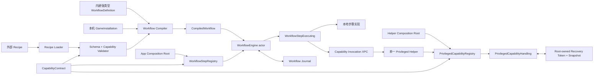

# 工作流运行时设计

Status: draft  
Owner: TingungX  
Last updated: 2026-08-24  
Scope: 外部游戏配方、工作流执行、状态恢复、特权能力调用  
Related code: `Sources/MacGameToolbox/AppCompositionRoot.swift`, `Sources/MacGameToolbox/ToolboxApplicationService.swift`, `Sources/MacGameToolbox/GenshinWorkflowCoordinator.swift`, `Sources/MacGameToolboxCore/`, `Sources/MacGameToolboxPrivilegedHelper/Capabilities/`
Related docs: `../decisions/0001-capability-bounded-external-recipes.md`, `../decisions/0002-single-helper-dual-capability-registries.md`, `../decisions/0003-ephemeral-pf-network-isolation.md`, `../specs/phase-1-genshin-workflow.md`

## 背景与问题

当前应用以功能卡片为入口，由 `AppModel` 分别编排 hosts、固定倒计时、Wine 进程检测和优先级调整。能力之间没有统一的执行模型：

- 用户必须在倒计时内手动启动游戏，应用并不拥有完整启动流程。
- 系统副作用只依赖局部 `defer` 风格恢复；App、helper 或系统异常退出后没有统一事务记录。
- 游戏差异硬编码在服务和界面中，新增游戏会继续扩大条件分支。
- 当前 XPC 请求表达单次操作，不表达运行租约、补偿动作或崩溃恢复。
- `AppModel` 直接创建具体服务并编排具体能力，界面状态、应用用例和系统副作用没有边界。
- root helper 通过一个不断扩张的 `switch` 承担鉴权、分发、参数验证和能力实现，难以独立测试与演进。

目标不是增加一个通用脚本执行器，而是建立一套由外部配方描述、由 App 内受信代码执行的游戏工作流运行时。

## 当前落地边界

当前代码已建立共享 capability contract、两个不可变注册表、通用 `WorkflowEngine`、用户态 journal、正式 capability XPC envelope，以及 root 侧 PF 租约与快照。原神以 Composition Root 中的内建强类型 plan 接入；`AppModel` 只调用 `ToolboxApplicationCoordinating` 和 `GenshinWorkflowCoordinating`，具体系统服务不再进入呈现层。

迁移期保留两条 helper 分发路径：原有 `PrivilegedRequest` 由独立 handler 组成的只读兼容注册表承接，保证现有 UI 行为不变；新工作流的 PF 隔离只走正式 `PrivilegedCapabilityRegistry`。其他旧能力在具备 contract 与副作用恢复语义前，不会向外部 Recipe 开放。Recipe loader/compiler 和外部导入 UI 仍属于后续阶段。

## 目标

- 每款游戏提供一个主要的“一键启动”入口。
- 将现有 MetalHUD、网络控制、进程检测和 QoS 等能力复用为工作流步骤。
- 允许用户编辑或导入配方，同时保证配方不能执行任意代码或任意 root 命令。
- 所有系统副作用都具备可验证的补偿动作、持久记录和超时恢复。
- 运行日志能够回答每一步何时开始、为何完成、为何失败以及是否完成恢复。
- 配方与本机安装信息分离，使配方可以共享，而不携带用户路径或机器状态。
- `AppModel` 只负责呈现状态和转发用户意图，不再认识 hosts、QoS、网络或具体游戏服务。
- 一个 root helper 进程内按能力拆分 handler，避免多个特权进程带来的安装、签名、升级和恢复成本。

## 非目标

- 第一阶段不提供任意 shell、AppleScript、动态库或插件执行能力。
- 第一阶段不建立在线配方市场、远程自动更新或配方签名基础设施。
- 第一阶段不承诺定向绕过任何反作弊；网络策略必须由本机实测证据决定。
- 第一阶段不并行运行多个游戏工作流。
- 第一阶段不拆分多个 root helper 进程。
- `Mac GameFlow` 只是内部工作名，本设计不决定正式品牌。

## 核心模型

### CapabilityContract

App 与 helper 只共享稳定的能力契约，不共享具体 handler 或游戏实现。每个 contract 至少描述：

- 稳定 capability ID 与独立 contract version；
- 输入 schema ID/version、大小限制与输出 schema；
- 普通权限或特权权限声明；
- 资源锁声明及由受信代码实现的 lock-key resolver；
- 是否产生系统副作用；
- 是否可回滚、回滚幂等性和 recovery token 版本。

Recipe 可以引用 capability ID，但不能定义 contract、资源锁或回滚逻辑。App 侧 contract 校验用于提前反馈和生成权限摘要，不构成安全边界；helper 必须根据自己的注册表重新解码、限制大小、验证版本和输入。

App 可以依据 contract 提前阻止冲突 workflow；特权资源锁的 lock key 必须由 helper 内受信 resolver 重新计算并强制执行，不能接受 Recipe 或 App 直接提交的锁结论。

### Recipe

外部 JSON 文件描述可移植的游戏流程。它可以引用运行时公开的步骤类型和受限参数，但不能包含绝对可执行路径、shell 字符串、环境变量注入或未经注册的特权操作。

最小字段：

- `schemaVersion`：配方格式版本。
- `id`：稳定、全局唯一的配方标识。
- `revision`：同一配方的递增修订号。
- `game`：显示信息和稳定游戏标识。
- `capabilities`：配方声明需要使用的能力集合。
- `steps`：有稳定 step ID 的有序步骤。

第一阶段允许的步骤类别：

- 环境预检。
- 开始或结束网络隔离。
- 通过已注册的启动适配器启动游戏。
- 等待受限的进程或内置 readiness probe。
- 对已识别的游戏进程树应用 QoS。
- 为本次启动配置 MetalHUD。
- 写入诊断事件。

具体 schema 在实现前由第一阶段 spec 固化。未知步骤、未知 capability、越界 timeout 和不支持的 schema 必须拒绝，不能降级忽略。

### GameInstallation

本机安装绑定由 App 通过 UI 创建并保存在自己的配置目录，不写入可分享配方。它负责：

- 用户选择并确认的 CrossOver App、bottle 或原生 App。
- 游戏根目录或启动目标的安全引用。
- 配方允许引用的启动适配器。
- 由 App 验证后的本机进程识别信息。

配方只能引用 `GameInstallation` 的逻辑字段，不能自行选择任意 executable。这样外部配方仍可编辑和分享，但无法把“一键启动游戏”变成“一键运行任意程序”。

### CompiledWorkflow

`WorkflowEngine` 不知道计划来源。迁移阶段的内建强类型 `WorkflowDefinition` 与后续外部 Recipe 都进入同一 compiler；外部 Recipe loader 只负责把数据转换成受限 definition。

运行前将 WorkflowDefinition、GameInstallation 和当前运行时 capability 合并为不可变执行计划。编译阶段完成：

- schema 与语义验证；
- capability 声明和实际步骤的一致性检查；
- 本机安装绑定检查；
- 每个副作用步骤的补偿能力检查；
- timeout、步骤数量和输入大小限制；
- 面向用户的权限与风险摘要生成。

只有编译成功的计划可以交给执行引擎。

## 组件边界



边界规则：

- Recipe Loader 只读取数据，不执行数据。
- `WorkflowStepRegistry` 只注册 App 进程内受信的步骤 executor，配方不能注册新 executor。
- `PrivilegedCapabilityRegistry` 只注册 helper 内受信的原子能力 handler。
- 两个注册表只能在各自 Composition Root 组装，构造完成后不可修改，并通过显式依赖注入传递；禁止暴露成全局 Service Locator。
- 工作流引擎不直接拼装 shell 命令。
- 工作流引擎只认识步骤协议，不认识具体游戏；helper 只认识特权能力协议，不认识具体游戏或 Recipe。
- helper 继续鉴权 XPC client，并根据自己的 contract 与 handler 重新验证每次 invocation；App 的预验证结果不可复用为信任结论。
- 用户态 journal 记录流程；root-owned journal 只记录恢复特权副作用所需的最小快照和租约。

### WorkflowStepRegistry

App Composition Root 将游戏启动、进程等待、readiness probe、MetalHUD 和特权能力适配步骤注册为不可变映射。每个 entry 由 step kind/version、声明的 capabilities 和 executor factory 构成。

`WorkflowEngine` 只通过 `WorkflowStepExecuting` 获取 prepare、execute 和 compensate 语义。`AppModel` 只依赖更高层的 `WorkflowCoordinating` 与只读运行状态，不直接持有具体 step executor 或系统服务。

### PrivilegedCapabilityRegistry

helper Composition Root 将网络、hosts、QoS、磁盘和主机名等能力注册为不可变映射。XPC 层只负责可信客户端检查、envelope 限制和 registry dispatch；每个 handler 独立完成强类型解码、领域验证、执行和回滚。

保留一个 root helper 进程。它统一持有资源锁与 root journal，但能力实现拆到独立 handler；暂不创建多个 LaunchDaemon 或 Mach service。迁移期旧 XPC 请求先通过独立 handler 的兼容注册表分发，正式 capability 注册表不因此接受缺少恢复语义的旧副作用能力。

### Capability Invocation

跨 XPC envelope 只携带 run ID、step ID、capability ID/version 和受大小限制的编码输入。helper 返回强类型输出摘要，以及副作用能力对应的不透明 recovery handle。

recovery handle 只暴露 token ID、capability ID/version，不携带 root 快照。helper 在改变系统状态前先将真实快照和 token 写入 root-owned journal，再执行能力并标记 token active。即使 App 在收到回复、但尚未来得及更新用户态补偿栈时崩溃，helper 仍能发现并恢复 active token。

## 执行状态机

单次运行状态：

```text
idle
  -> validating
  -> preparing
  -> running(step N)
  -> succeeded

running / preparing
  -> compensating
  -> failed | cancelled

App/helper unexpected exit
  -> recoveryRequired
  -> compensating
  -> recovered | recoveryFailed
```

第一阶段冲突由 **资源锁** 决定，而不是引擎全局互斥。`WorkflowEngine` 允许不同 run ID 并发；独占锁（全局网络隔离、同一 CrossOver 容器）冲突时向用户展示选择，默认保持当前工作流。

App 重启时：若当前步骤是 holding（等待游戏退出），恢复该步骤并继续跟踪；启动期未完成的 run 仍反向补偿。

### 工作流管辖的全局状态

副作用可以落在全机状态上，所有权必须落在某条 run 上：

- 独占锁（`WorkflowExclusiveLockTable`）：`network.globalIsolation`、`process.session.crossover.<bottle>`。同一 key 不能被两条 run 同时持有。启动前若冲突，界面让用户选择保持当前工作流（引导选项）或结束当前再启动新的。
- 共享 claim（`GameModeClaimLedger`）：Game Mode 是全机一条策略，但由各 run 占用。第一个占用者快照原策略并 `set on`；最后一个释放者才写回快照。功能模块开关在有 holder 时不得管辖该策略。
- 进程收尾只终止本 run 声称的 bottle 进程，不杀 CrossOver GUI，也不扫全机 Wine。

暂不引入通用“全局资源池”实现层；上述 ledger 是 Game Mode 与独占锁的简单实现。

holding 步骤（如等待游戏退出）使工作流在启动成功后继续作为一等公民，直到游戏退出、残留进程结束并释放 claim。

## 副作用与补偿

执行每个有副作用的步骤时遵循 write-ahead 顺序：

1. 验证步骤输入和当前前置条件。
2. 持久化“准备执行”以及补偿描述。
3. 执行副作用。
4. 验证副作用已经生效。
5. 持久化“已执行”，再进入下一步。

失败或取消时按相反顺序执行补偿。补偿必须幂等；某个补偿失败时继续尝试其他独立补偿，并最终报告所有未恢复项，不能用 `try?` 静默吞掉。

特权步骤的补偿栈保存 helper 返回的不透明 recovery handle。回滚时 App 只提交 handle；helper 根据原 capability/version 找到相同 handler、读取 root 快照并重新验证当前状态。Recipe 不能创建、修改或伪造 recovery handle。

### 网络隔离租约

全局网络隔离是最高风险步骤，除普通补偿外必须满足：

- helper 在 root-owned journal 中保存恢复所需快照。
- 隔离以短时租约生效，App 通过本地 XPC 心跳续租。
- App 消失、心跳停止或租约到期时，helper 自动恢复网络。
- helper 重启后先读取未完成租约；已过期则恢复，未过期则继续计时。
- App 下次启动主动查询并恢复任何 stale run。
- 应用隔离后验证 PF 已启用且项目 anchor 只有固定规则；恢复后验证该 anchor 已清空。远端连通性不是 PF 状态的可靠前置条件，不以访问某个公网服务代替本机状态验证。

第一阶段按 ADR-0003 使用 helper 管理的临时 PF 子 anchor。handler 只加载和清理项目自己的 anchor，使用 PF enable reference token 与 root journal 实现租约恢复，并在隔离规则生效后清理既有 PF states。Recipe 只看到稳定的 `network.globalIsolation` capability，不能提供 anchor、规则或 PF 参数。

## 配方信任与权限呈现

配方分为 bundled、local 和 imported 三种来源，但来源不是安全边界。所有来源都经过同一 validator。

导入或 capability 变化时，界面展示：

- 将启动的游戏安装绑定；
- 需要的普通能力与特权能力；
- 是否会短时中断全机网络；
- 每项系统副作用的恢复保证；
- 配方 ID、revision 和内容摘要。

第一阶段允许用户编辑并重新导入配方；不允许后台静默替换已批准 revision。

## 日志与隐私

每个运行事件至少包含 run ID、recipe ID/revision、step ID、状态、时间戳、耗时和结构化错误类别。默认不记录：

- 用户账号、token 或游戏会话数据；
- 完整命令行中的敏感参数；
- 数据包正文或 TLS 内容；
- 未经裁剪的用户目录路径。

诊断导出前继续进行敏感字段过滤。网络证据只记录连接元数据和状态转换，不进行 MITM。

## 失败处理

- Recipe 无效：执行前失败，不产生副作用。
- 启动目标丢失：要求用户重新绑定，不从配方猜测路径。
- readiness 超时：恢复网络和其他副作用后失败。
- App 取消：进入补偿状态，在恢复完成前不显示“已取消完成”。
- helper 不可用：任何特权步骤之前失败；不能部分执行后跳过。
- 恢复不完整：显示明确的 recovery failed 状态、未恢复项目和修复入口。

## 验证标准

- Recipe parser、validator 和 compiler 的纯逻辑单元测试。
- 未知步骤、任意命令字段、绝对 executable 路径、超限 timeout 和 capability 不匹配均被拒绝。
- 两个注册表只能由 Composition Root 构造，启动后注册失败或重复 capability ID 会直接阻止启动。
- helper 对畸形 payload、错误版本、越权 capability 和伪造 recovery handle 的独立拒绝测试。
- 现有 helper 请求迁移到 handler 后具有行为等价测试，确保拆分本身不改变系统操作。
- 引擎成功、失败、取消、并发 run 和反向补偿顺序测试。
- journal 在每个步骤边界注入崩溃后的恢复测试；holding 步骤崩溃后恢复为 resume，而非补偿仍在运行的游戏。
- helper 租约到期、helper 重启和 App 重启恢复测试。
- 独占资源冲突时由用户选择；默认保持当前工作流。
- 完整测试与构建无新增 warning。

## 未决问题

- 第一版 Recipe schema 的最终字段和大小上限。
- 原神“反作弊已通过”的可自动验证信号。
- CrossOver 启动适配器需要支持的最低版本和 bottle 发现方式。
